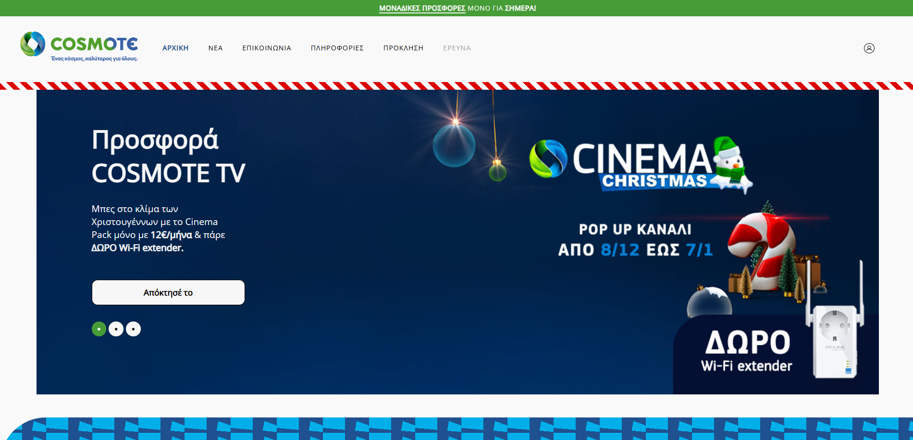
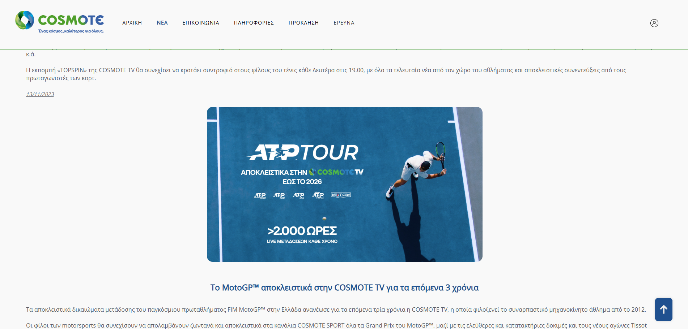
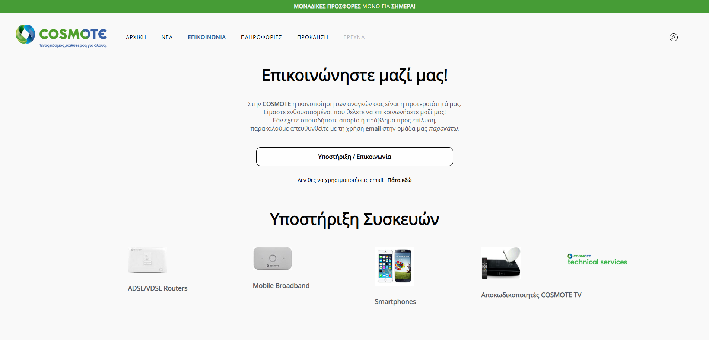
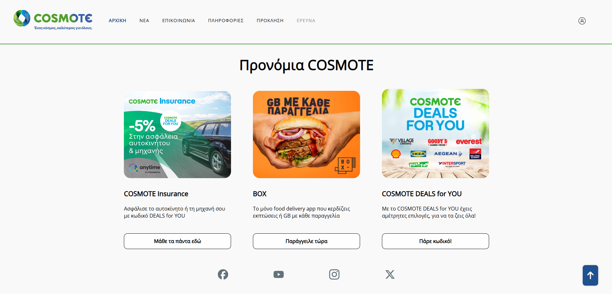
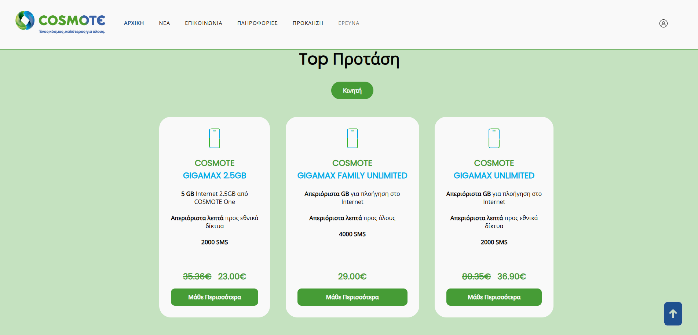

# 🌐 Cosmote Mockup Website

This project is a **fully functional mockup website** designed for Cosmote, Greece’s leading telecommunications provider. Created as part of a **university assignment**, the site closely mirrors the structure, branding, and user experience of Cosmote’s official website, while incorporating original design and development elements.

---

## 🛠️ Technologies Used

- **HTML5, CSS3, JavaScript**\
- **PHP, SQL**
- **Bootstrap 5** for responsive UI
- **VS Code** (development IDE)

---

## 📄 License

This project is open-source.

---

## 🤝 Contributing

Pull requests are welcome! Please follow standard GitHub flow and keep the code clean and documented.

---

## 📬 Contact

For questions, contact me at [obrizanou@gmail.com](mailto:obrizanou@gmail.com) or open an issue.
