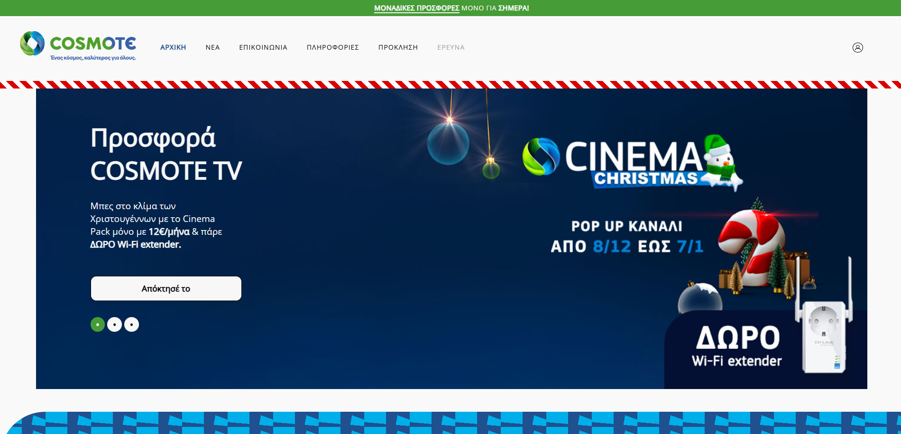
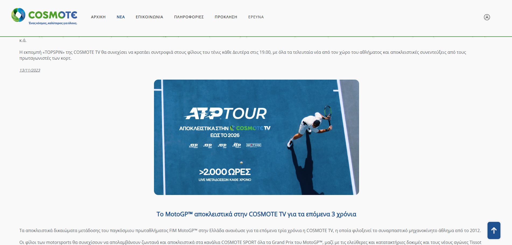
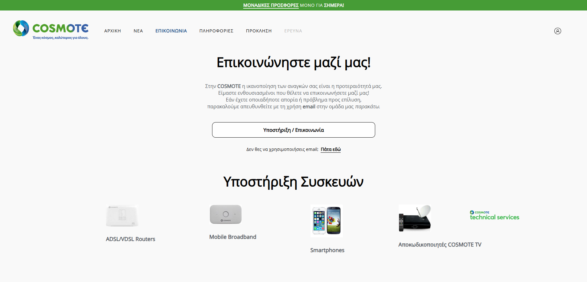
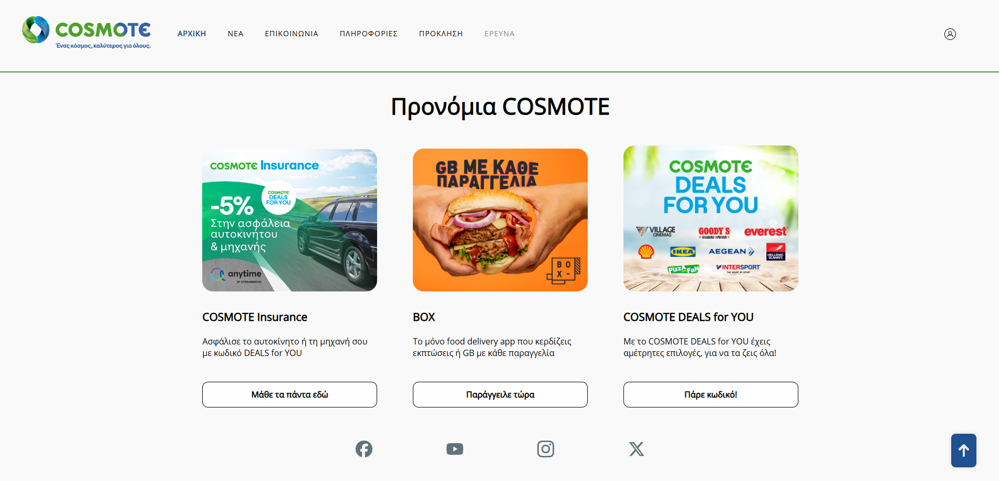
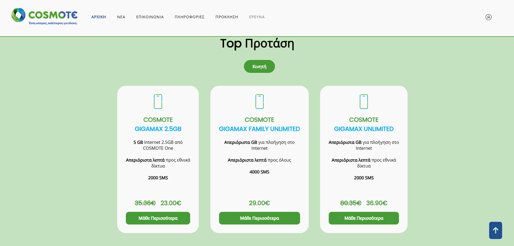

<h1 align="center">Cosmote Web Mockup</h1>
<h3 align="center">Full-Stack Telecommunications Portal Simulation | PHP & MySQL</h3>

<p align="center">
  A high-fidelity full-stack web simulation inspired by the Cosmote telecommunications enterprise platform. This architecture leverages native server-side scripting and relational database management to simulate real-world service lookups, dynamic content delivery, and account data mutations within a secure, responsive monolithic framework.
</p>

<p align="center">
  <a href="https://opensource.org/licenses/MIT">
    
  </a>
</p>

---

### ✨ Core Features

* **Relational Data Orchestration:** Powered by PHP backend controllers handling structured queries against a SQL layer to dynamically generate customer dashboard entries, plans, and service availability frameworks.
* **Server-Side Rendering (SSR):** Leverages a decoupled procedural MVC structure to securely process client-side operations, manage dynamic user sessions, and render view models without reliance on bloated SPA layers.
* **Enterprise Information Architecture:** A meticulously organized UI mimicking national telecom platform designs, featuring multi-layered navigation drawers, modular account settings, and data-dense services presentation.
* **Adaptive Grid Fluidity:** Implements full Bootstrap 5 layout paradigms to guarantee strict design fidelity, accessibility standards, and pixel-perfect rendering across standard mobile viewports, tablets, and wide screens.

---

### 🛠️ Production Stack

**Server Architecture & Infrastructure Engine**
<p align="left">
  
  
  
</p>

**Relational Storage & Data Layer Isolation**
<p align="left">
  
  
</p>

**Client Presentation & View Interface**
<p align="left">
  
  
  
  
</p>

---

### 📸 Application Showcase

<p align="center">
  
  
</p>
<p align="center">
  
  
</p>
<p align="center">
  
</p>

---

### 🚀 Getting Started (Local Development)

**1. Infrastructure Prerequisites:**
* **Local Web Server:** Install an environment stack container like **XAMPP**, **WAMP**, or **MAMP** to provide the Apache HTTP and MySQL server environments.

**2. Repository Extraction:**
* Clone this repository directly into your local server environment root folder (e.g., `C:/xampp/htdocs/` for XAMPP):
```bash
git clone https://github.com/filipposobrijanu/Cosmote-Mockup-Website.git
cd Cosmote-Mockup-Website
```

**3. Relational Storage Schema Import:**
* Launch **phpMyAdmin** or your chosen database GUI client via `http://localhost/phpmyadmin`.
* Generate a empty database instance named `cosmote_db`.
* Locate the initialization `.sql` script inside the workspace files and execute an **Import** query to map out the application tables and seed records.

**4. Configuration & Native Server Execution:**
* Open the source directory inside your IDE and navigate to the database connectivity logic block. Ensure variables align with your environment:
```php
$servername = "localhost";
$username = "root";
$password = ""; // Add your localized server database password here
$dbname = "cosmote_db";
```
* Start the Apache and MySQL modules inside your control panel and visit `http://localhost/Cosmote-Mockup-Website` in your web browser.
